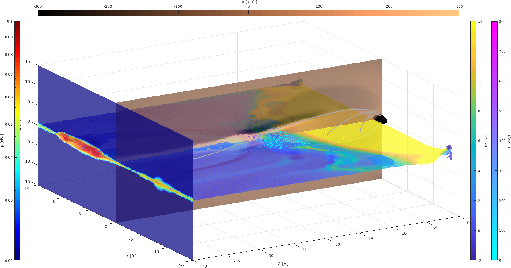

# Plot BATS-R-US output in MATLAB

## Example of output:



## Warning:
Working but in development.\
Can only treat single species run at the moment.\
Documentation and error handling is minimalist/non-existent.
Only the plot function has documentation and examples.

## Install:
If you have git installed on your machine:
```
git clone https://github.com/AlexDs20/BATS-R-US-Analysis
```

If you do not have git, simply download the zip and extract where you want.\

Be sure to add the path so that MATLAB can find the functions.\


###Requirements:
In order for the plots to work correctly, please have a look at the external
tools that are dependencies (found at external/README.md).\
For each of the dependencies, a link to the MATLAB file exchange site or github can be found.\
Not all of them are necessary.

## What is implemented:

- [x] Conversion from the adaptive grid to uniform grid using interpolation
- [x] All the quantities from the momentum equation (see eq. 7 and 10 from Powell
et al.\ 1999).
- [x] A large number of derived parameters (find exhaustive list below).
- [x] Powerful and user-friendly plot function
- [x] Plot Slice: simple straight cut in the domain
- [x] Plot Quiver: vector field shown using vectors in 3D in a defined rectangular domain
- [x] Plot Contour: level contour of a quantity in the requested plane
- [x] Plot Stream: trace a line along the requested vector field starting at a
certain position
- [x] Plot Surface: Allows *any* cuts in the domain provided by the user. The
user must give a mesh for the surface.
- [x] Plot Isosurface: Find the surface for which a variable has a given value.
The color on the surface may be requested to be that of a field.
- [x] Plot "spacecraft" observations (give position and return time-series like
  plot, but the x-axis is the position)

## What is *not* implemented (yet):
- [ ] Quiver plot on a mesh given by the user
- [ ] Quiver plot on the isosurface
- [ ] Quiver: log color scale and length/head angle properties
- [ ] Handle other runs than single species runs
- [ ] Lighting to make the figure sick af!
- [ ] Documentation
- [ ] a "plot Earth" (with nice texture)
- [ ] Find last closed field lines
- [ ] Handle leaves of adaptive grid
- [ ] Plot of the original adaptive grid (for the *bats* class)
- [ ] Adding own fields easily

## Quick start:
There are two classes implemented: *bats* and *batsUni*.\
The class *bats* would read the direct *cdf* output files from BATS-R-US runs.
The *batsUni* class is used for the uniform mesh data (i.e. the interpolated
data that are saved in a *bats* object).\

In general, you don't want to do anything with the *bats* class as it does not
allow for plotting (yet).
Just use it to load the data and change to *batsUni* class using *toBatsUni*
function.
This will interpolate the data to the grid requested by the user.\

Now that you have a *batsUni* object, feel free to calculate a quantity and plot
it.

### Use:
**1. Load the data:**
```matlab
data = bats('file',string_to_cdf_file);
```
The *'file'* argument lets the program know that the next argument is the path
to the cdf file.

**2. Convert to uniform grid**
```matlab
uni = data.toBatsUni(0.125,{'bx','by','bz','ux','uy','uz','jx','jy','jz','rho','p'}, ...
                'xrange',[-40 0],'yrange',[-15 15],'zrange',[-15 15]);
```
The arguments are, in order:\
(1) new grid resolution, (2) Variables to interpolate, (3--5) x,y and z range of
the domain to consider.\
The last parameters allow to interpolate only a smaller part than the whole
domain.

Now looking at uni.Output, you will see that it is a mesh rather than a list.

**3. Plot**\
Looking at uni.Output and uni.Derived gives you the name of the variables to
plot.
```matlab
uni.plot('newfigure', 'isosurface','variable','bx','level',0,'xrange',[-40 -5],'alpha',0.7,'colorposition','right','colorvariable','ux','color','jet');
uni.plot('slice','variable','ux','yslice',0,'color','jet','colorposition','right','alpha',0.7);
uni.plot('stream','variable','b','start',[-25 -7 0],'color',[1,0,1],'linewidth',2);
```
Other plots are possible by calling uni.plot('plottype') with plottype:\
slice/quiver/contour/stream/surface/isosurface.

More examples can also be found in the Example folder.\

Check the extensive help for the plot function:
```matlab
help batsUni.plot
```

To **plot spacecraft observations**, use *uni.plotSC* function.\

**1. Create spacecraft positions**\
Create an (Nx3) array where you want the data.
```matlab
pos(:,1) = [-18.00:0.125:-15.00];
pos(:,2) = 0.000 + zeros(size(pos,1),1);
pos(:,3) = 0.000 + zeros(size(pos,1),1);
```

**2. Variables to plot**\
Create a cell array for the variables to plot.\
Each entry of the cell array correspond to a subplot of the figure.\
If an entry of the cell array is also a cell array, those variables are plotted on the same
subplot.
```matlab
% Create the cell array of variables to plot (5 subplots).
var = { {'ux','uy','uz'},  {'bx','by','bz'}, {'jx','jy','jz'}, 'rho', 'p' };
```

Here, each component of the vector fields **u**, **b** and **j** are plotted on the same subplot.\
*rho* and *p* are plotted on their own subplots.\

**3. Plot**\
```matlab
uni.plotSC(pos,var);
```

## Non-Uniform grid class: bats
The only thing this class can do is read a *cdf* file, calculate a bunch of physical quantities (see table below) and create a *batsUni* object (see below).
No plot or anything else is provided for this class (yet, because I don't know how to
nicely handle the leaves of the adaptive grid so that plots could easily be made).

Basic knowledge about the simulation is stored in:
```matlab
obj.Global
```
It contains the units for the variables, the range, the name of the loaded file.

The output quantities from the simulation are in:
```matlab
obj.Output
```
All the quantities that can be calculated are in:
```matlab
obj.Derived
```
and may be calculated using:
```matlab
obj.calc_*
```
where the * is the quantity to calculate.
Note that some of the calculations depend on each other and the user should call
them in order!

Functions               | Calculates                                                                             | Necessary parameters
------------------------|----------------------------------------------------------------------------------------|----------------------
*calc_b*                | magnitude of the magnetic field                                                        | bx,by,bz
*calc_b1*               | magnitude of the magnetic field deviation to the dipole                                | b1x, b1y,b1z
*calc_u*                | magnitude of the bulk velocity                                                         | ux,uy,uz
*calc_rhoU*             | momentum                                                                               | rho,ux,uy,uz
*calc_j*                | current density                                                                        | jx,jy,jz
*calc_jxb*              | $$\mathbf{J}\times\mathbf{B}$$ force                                                   | jx,jy,jz,bx,by,bz
*calc_E*                | Electric field as $$-\mathbf{u}\times\mathbf{B}$$                                      | ux,uy,uz,bx,by,bz
*calc_temp*             | Temperature as: $$T = \frac{P}{n}$$ (in eV)                                            | p, rho
*calc_pb*               | Magnetic pressure                                                                      | b (i.e. must call calc_b first)
*calc_beta*             | Plasma beta                                                                            | p,pb
*calc_alfven*           | Alfven speed                                                                           | b,rho
*calc_vth*              | Thermal speed as: $$v_{th} = \sqrt{2*P/(n*m)}$$                                        | temp
*calc_gyroradius*       | Ion (proton) gyroradius                                                                | u,vth,b
*calc_plasmafreq*       | Ion plasma frequency                                                                   | rho
*calc_inertiallength*   | Ion inertial length                                                                    | alfven,plasmafreq
*calc_electronVelocity* | Electron velocity as: $$\mathbf{V}_e = \mathbf{u} - (m_p/(m_p+m_e)) * \mathbf{J}/en$$  | rho,jx,jy,jz,ux,uy,uz
*calc_protonVelocity*   | Proton velocity as: $$\mathbf{V}_i = \mathbf{u} + (m_e/(m_p+m_e)) * \mathbf{J}/en$$    | rho,jx,jy,jz,ux,uy,uz
*calc_all*              | Calculates all the derived quantities                                                  |

Note that, because the data are in list form (due to the leaves structure), we do not calculate any
derivative-based quantities.\
This class (*bats*) inherits from the *dynamicprops* class meaning that you can
add new properties that I have not implemented:
```matlab
obj.addprop('NewProperty');
obj.NewProperty = 1:10
```
However, the plot function will crash as no units will be associate to the new
field (a better implementation will come soon :) ).
For more info, see: [matlab dynamicprops]

[matlab dynamicprops]: https://se.mathworks.com/help/matlab/ref/dynamicprops-class.html

### Example:
Say we want to calculate the JxB-force:
1. Load the data
```matlab
data = bats('file',string_to_file,'var',{'x','y','z','jx','jy','jz','bx','by','bz'});
```
The inputs go by pair.\
'file' says that the following input will be the string of the file ...

2. Calculate it
```matlab
data.calc_jxb;
```

3. See that it is now calculated:
```matlab
data.Derived
```

jxb is no longer empty.

## Uniform-grid class: batsUni (subclass of bats)
The second class is called batsUni and is a subclass of bats.
This means that it inherits all the calculation of the derived parameters in the
table above.
This class is made to handle uniform mesh simulations (only BATS-R-US atm) so that plots and derivatives
can easily be evaluated.

Additional calculations are the followings:

Functions               | Calculates                                                                                                               | Necessary parameters
------------------------|--------------------------------------------------------------------------------------------------------------------------|----------------------
*calc_gradPb*           | Gradient of magnetic pressure                                                                                            | pb
*calc_gradP*            | Gradient of the plasma pressure                                                                                          | p
*calc_vorticity*        | Vorticity as: $$\mathbf{\omega}= \nabla\times\mathbf{u}$$                                                                | ux,uy,uz
*calc_divBB*            | Divergence of the magnetic energy "tensor" as: $$\text{Output} = \nabla\cdot\left(\frac{\mathbf{BB}}{\mu_0}}\right)$$     | bx,by,bz
*calc_divRhoUU*         | Divergence of the magnetic energy "tensor" as: $$\text{Output} = \nabla\cdot\left(\rho\mathbf{uu}\right)$$                | rhoUx,rhoUy,rhoUz,ux,uy,uz

Also, the following functions are implemented:

Functions   | Effect                                                            | Parameters
------------|-------------------------------------------------------------------|-----------
*getData*   | Returns a *batsUni* object with data at the requested *positions* | positions (Nx3)
*plotEarth* | Plot earth of radius 1 at (0,0,0)                                 |
*plot*      | See documentation: *help batsUni.plot*                            |
*plotSC*    | Plot artificial spacecraft observations: *help batsUni.plotSC*    | positions, variables to plot

